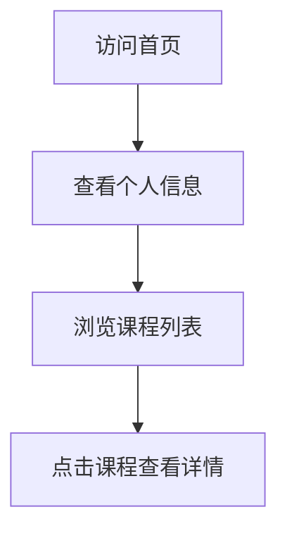

## 1. Product Overview
个人学生页面，展示陈雪霜的个人信息和课程列表
- 主要目的是展示学生个人信息和课程信息，方便后续补充课程内容
- 目标用户是学生本人、同学和教师

## 2. Core Features

### 2.1 User Roles
| Role | Registration Method | Core Permissions |
|------|---------------------|------------------|
| 访问者 | 无需注册 | 浏览页面内容 |

### 2.2 Feature Module
1. **首页**: 个人信息展示，课程列表，导航栏

### 2.3 Page Details
| Page Name | Module Name | Feature description |
|-----------|-------------|---------------------|
| 首页 | 个人信息 | 展示姓名、学校、专业等基本信息 |
| 首页 | 课程列表 | 展示多个课程信息，后续可点击进入详细内容 |
| 首页 | 导航栏 | 提供页面导航功能 |

## 3. Core Process
用户访问页面 → 查看个人信息 → 浏览课程列表 → 点击课程查看详情（后续功能）

## 4. User Interface Design
### 4.1 Design Style
- 主色调：蓝色系 (#165DFF)，辅助色：白色 (#FFFFFF)、浅灰色 (#F5F7FA)
- 按钮风格：圆角按钮，悬停效果
- 字体：无衬线字体，标题使用较大字号
- 布局风格：卡片式布局，清晰的信息层次
- 图标风格：简约线条图标

### 4.2 Page Design Overview
| Page Name | Module Name | UI Elements |
|-----------|-------------|-------------|
| 首页 | 个人信息 | 大标题展示姓名，副标题展示学校和专业，使用卡片式布局，配有个人头像占位 |
| 首页 | 课程列表 | 网格布局展示课程卡片，每个卡片包含课程名称和简短描述，悬停有动画效果 |
| 首页 | 导航栏 | 顶部固定导航栏，包含页面标题和导航链接 |

### 4.3 Responsiveness
- 桌面优先设计，适配移动端
- 移动端使用单列布局，课程卡片垂直排列
- 响应式断点：768px、1024px

### 4.4 3D Scene Guidance
- 无3D场景需求