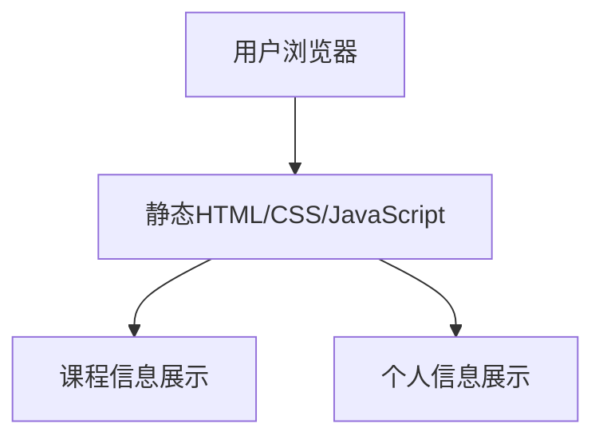

## 1. Architecture Design

## 2. Technology Description
- Frontend: 纯HTML5 + CSS3 + JavaScript
- 样式框架: Tailwind CSS
- 构建工具: Vite
- 部署平台: Cloudflare Pages

## 3. Route Definitions
| Route | Purpose |
|-------|---------|
| / | 首页，展示个人信息和课程列表 |

## 4. API Definitions
- 无后端API需求，纯静态页面

## 5. Server Architecture Diagram
- 无后端服务器需求

## 6. Data Model
- 无数据库需求，使用静态数据

### 6.1 Data Model Definition
- 课程数据：名称、描述、图标
- 个人信息：姓名、学校、专业

### 6.2 Data Definition Language
- 无数据库需求，使用JSON或直接在HTML中定义